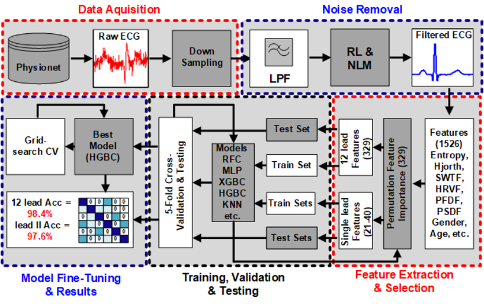
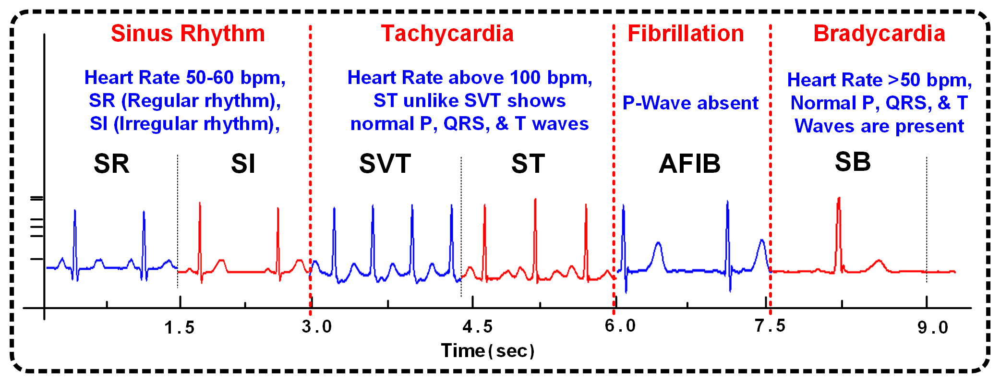
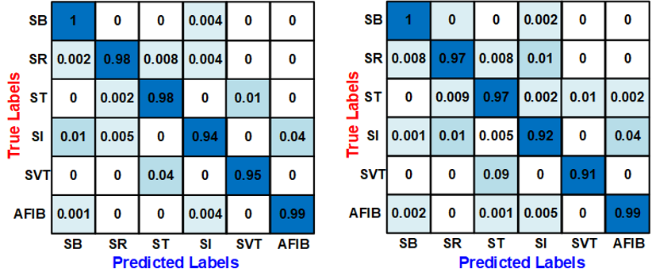

# Single-Lead ECG Arrhythmia Classification

  

A Machine Learning pipeline for detecting 6 types of cardiac arrhythmias using **Single-Lead ECG** signals. This project implements the methodology from our paper **"Cardiac Arrhythmias Classification Using Machine Learning and Single-Lead ECG"**, published in the *2023 IEEE 66th International Midwest Symposium on Circuits and Systems (MWSCAS)*.

The model achieves **97.6% accuracy** using only Lead II data, demonstrating that computationally efficient models can perform effectively in low-resource environments (e.g., wearable devices).

---

## 📸 Methodology
The workflow consists of three main stages: Preprocessing (De-noising), Feature Extraction/Selection, and Classification using Histogram Gradient Boosting (HGBC).


*Fig 1. Proposed workflow: ECG data is de-noised, features are extracted/selected, and used to train the HGBC model.*

### Pipeline Steps:
1.  **Noise Reduction:** Utilized Non-Local Means (NLM) de-noising, Butterworth low-pass filters, and Robust LOESS to remove baseline wander and muscle artifacts.
2.  **Feature Extraction:** Extracted 1526 features (temporal, spectral, nonlinear, entropy) and reduced them to **35 key features** using Permutation Feature Importance.
3.  **Classification:** Trained a Histogram Gradient Boosting Classifier (HGBC), which is optimized for memory efficiency (~350MB) and speed.

---

## 📊 Arrhythmia Types Detected
The model classifies the following 6 rhythms:


*Fig 2. Comparison of ECG Lead II for different arrhythmias.*

* **Normal Sinus Rhythm (SR):** Normal beat (60-100 bpm).
* **Sinus Bradycardia (SB):** Slow heart rate (<60 bpm).
* **Sinus Tachycardia (ST):** Fast heart rate (>100 bpm).
* **Sinus Irregularity (SI):** Irregular rhythm, common in young people.
* **Supraventricular Tachycardia (SVT):** Rapid rhythm originating above ventricles.
* **Atrial Fibrillation (AFIB):** Irregular atrial beating, includes Atrial Flutter.

---

## 📈 Performance
The model was evaluated on 11,381 patients using the Chapman University ECG dataset.

| Model Configuration | Accuracy | Precision | Recall | F1-Score |
| :--- | :--- | :--- | :--- | :--- |
| **12-Lead (Baseline)** | 98.4% | 0.98 | 0.98 | 0.98 |
| **Single-Lead (Lead II)** | **97.6%** | **0.97** | **0.96** | **97.0** |

*Table 1. Performance comparison showing Single-Lead accuracy is comparable to 12-Lead setups.*


Fig 3. Comparison of the ECG Lead II-trained confusion matrix with the 12-Lead ECG Confusion Matrix.

---

## 📂 Data Availability
This project utilizes the **Chapman University / Shaoxing People's Hospital ECG Dataset** available via PhysioNet.

> **⚠️ Note:** Due to licensing and file size limits, the raw dataset is **not** included in this repository.

**To run this code:**
1.  Download the dataset from [PhysioNet](https://physionet.org/content/ecg-arrhythmia/1.0.0/).
2.  Unzip the files.
3.  Place the data in a folder named `data/` in the root directory.
4.  Update the path in the notebook if necessary.

---

## 🚀 How to Run

### 1. Install Dependencies
```bash
pip install -r requirements.txt
```
### 2. Run the Notebook
Open `ECG_Arrhythmia_Classification.ipynb` in Jupyter Notebook or Google Colab.

* **Input:** Raw ECG files.
* **Process:** The notebook handles downsampling, filtering, and feature extraction.
* **Output:** Classification metrics and Confusion Matrix.

## 📜 Citation
If you use this code or methodology, please cite our paper:

```text
M. A. Nauman, C. Failor and W. Saadeh, "Cardiac Arrhythmias Classification Using Machine Learning and Single-Lead ECG," 
2023 IEEE 66th International Midwest Symposium on Circuits and Systems (MWSCAS), Phoenix, AZ, USA, 2023.
DOI: 10.1109/MWSCAS57524.2023.10406134
```

## 🤝 Acknowledgments
* **PhysioNet:** For providing the open-access arrhythmia dataset.
* **Open Source Community:** Certain feature extraction utilities in this codebase were adapted from implementations by Goodfellow et al. (See code comments for details).
